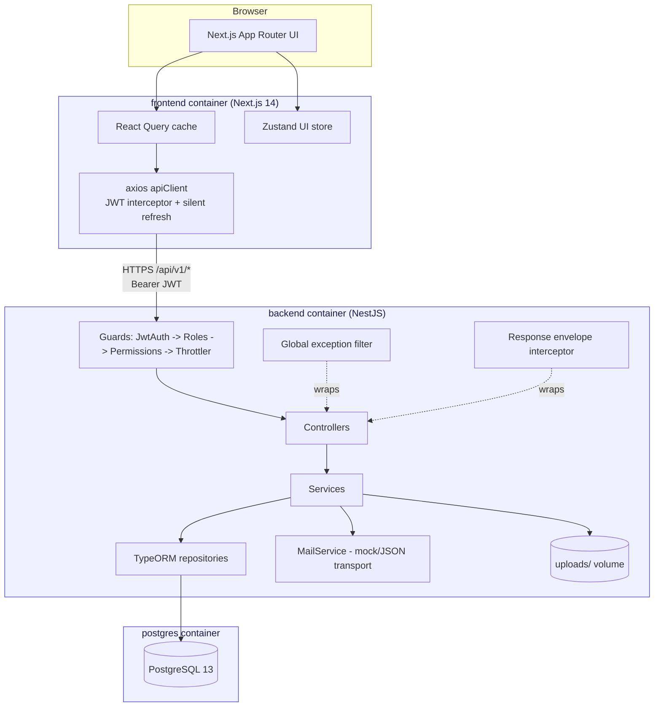
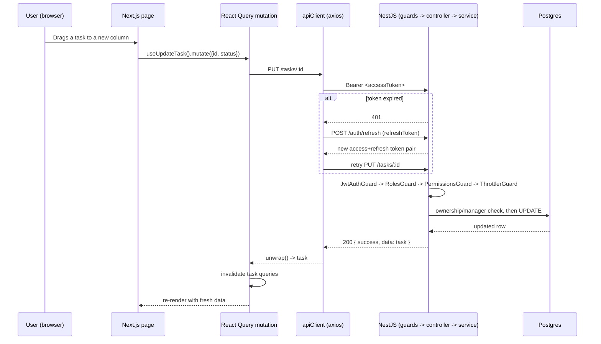

# Architecture

## System overview

- **Frontend** — Next.js 14 App Router, TypeScript, Tailwind. Server state lives in React Query
  (keyed by resource + filters, with optimistic mutations for deletes/status changes); the only
  client-only UI state (sidebar collapse, etc.) lives in a small Zustand store. `next-themes` drives
  dark mode. All API calls go through one axios instance (`lib/apiClient.ts`) that attaches the
  access token, and on a 401 attempts a single silent refresh via `/auth/refresh` before falling
  back to a redirect to `/login`.
- **Backend** — NestJS, modular by domain (`auth`, `users`, `roles`, `projects`, `tasks`, `comments`,
  `files`, `notifications`, `activities`, `reports`, `dashboard`). Every request passes through four
  global guards (JWT authentication, role check, permission check, rate limiting), a global exception
  filter (consistent `{ success, statusCode, ... }` error shape), and a response interceptor (same
  envelope shape for success). TypeORM maps entities to Postgres; schema is owned entirely by
  migrations (`backend/src/database/migrations`), never `synchronize`.
- **Database** — PostgreSQL, one schema, soft-deleted rows excluded automatically by TypeORM. See
  [er-diagram.md](./er-diagram.md).
- **Docker Compose** — three services (`frontend`, `backend`, `postgres`) on one network; the backend
  waits on Postgres's healthcheck before starting and runs pending migrations on boot.

## Request lifecycle (example: `PATCH /api/v1/tasks/:id`)

## Auth & authorization

- **Authentication**: JWT access token (15m default) + rotating refresh token (7d default, hashed at
  rest, single-active-session revocation on reuse). Forgot/reset password issues a hashed,
  1-hour-expiry token and a mock email (nodemailer JSON transport, logged not delivered).
- **Authorization**: two layers, both admin-configurable rather than hard-coded everywhere —
  role name (`@Roles('Admin', ...)`, with `Super Admin` implicitly authorized everywhere) for coarse
  checks, and `Role.permissions` (`@RequirePermissions('manage_tasks')`) for fine-grained ones. The
  frontend mirrors both (`AuthContext.hasRole`/`hasPermission`) to gate UI, while the backend guards
  are the actual enforcement point.
