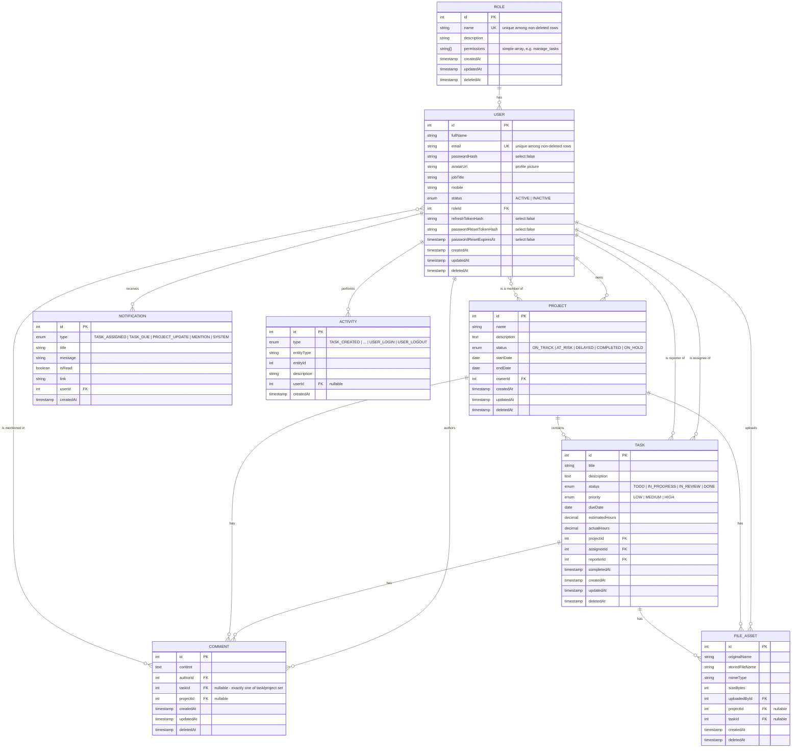

# Database ER Diagram

Generated from the current schema (`backend/src/database/migrations`) — see also
[`db/schema.sql`](../db/schema.sql) for the literal `CREATE TABLE` statements. Every table except
`notification` and `activity` has a soft-delete `deletedAt` column (TypeORM excludes soft-deleted rows
from every query automatically); audit fields are `createdAt`/`updatedAt` on all but `activity` and
`file_asset`, which are append-only/immutable and only track `createdAt`.

## Notes

- `project_members` and `comment_mentions` are plain many-to-many join tables (no extra columns),
  shown above as `}o--o{` relationships rather than separate boxes.
- Indexes: `user.email` and `role.name` are partial-unique (`WHERE "deletedAt" IS NULL`, so a
  soft-deleted row's identity can be reused); `user.status`, `project.status`, `task.status`,
  `task.priority`, `task.dueDate`, `notification.userId`, `notification.isRead`, `activity.createdAt`,
  `comment.taskId`, `comment.projectId`, `file_asset.projectId`, and `file_asset.taskId` all have
  supporting B-tree indexes for the filters/sorts the API exposes on each.
